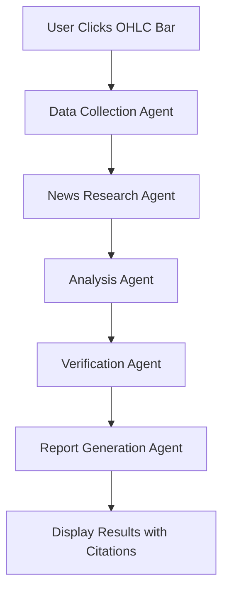

# VizAI Agentic Research System - Development Roadmap

> **Objective**: Build an AI-powered stock analysis system that explains price movements through credible, multi-source research with confidence scoring.

## 🎯 **Project Vision**

When users click on any OHLC candlestick in our stock chart, an intelligent agent will:
- Analyze the price movement for that specific day
- Research relevant news and market events (3-5 days prior)
- Correlate events with price changes using AI reasoning
- Provide credible explanations with top 3 citations
- Display confidence scores based on source reliability
- Cross-reference multiple sources for accuracy

---

## 🏗️ **System Architecture Overview**



### **Multi-Agent System Design**
- **📊 Data Agent**: Collects price, volume, market context
- **📰 News Agent**: Searches for relevant news in date range
- **🔍 Analysis Agent**: Correlates news with price movements
- **✅ Verification Agent**: Cross-references sources, checks credibility
- **📝 Report Agent**: Generates final explanation with citations

---

## 📋 **Development Phases**

## 🚀 **Phase 1: Enhanced Data Collection (Foundation)**
*Timeline: Week 1-2*

### **1.1 Multi-Timeframe Data API**
- [ ] Extend current `/api/stock/[symbol]` to fetch 1-week, 1-month historical data
- [ ] Add market context: S&P 500, sector performance for the same period
- [ ] Include volume analysis: Unusual volume spikes often indicate news
- [ ] Get basic fundamentals: Market cap, P/E, recent earnings dates

### **1.2 News & Events Data Sources**
- [ ] **Financial News APIs**: Alpha Vantage News, NewsAPI, Polygon.io news
- [ ] **Economic Calendar**: FRED API for economic indicators, earnings calendars
- [ ] **Social Sentiment**: Reddit/Twitter mentions (optional, but powerful)
- [ ] **SEC Filings**: Recent 8-K, 10-Q filings that might affect price

### **1.3 API Route Structure**
```
/api/analysis/[symbol]/[date]     - Main analysis endpoint
/api/news/[symbol]/[dateRange]    - News collection
/api/context/[symbol]/[date]      - Market context data
/api/sources/verify               - Source credibility checker
```

---

## 🤖 **Phase 2: Agentic Research Architecture**
*Timeline: Week 3-4*

### **2.1 Gemini Pro Integration Strategy**
- [ ] Set up Gemini Pro API (free tier: 15 requests/minute)
- [ ] Implement function calling for structured data extraction
- [ ] Design chain of thought prompting for better reasoning
- [ ] Create source verification through multiple model calls

### **2.2 Core Intelligence Development**
- [ ] Build first AI agent for news-price correlation
- [ ] Implement basic source credibility scoring
- [ ] Create confidence calculation system
- [ ] Test with major price movement events

### **2.3 Gemini Function Calling Schema**
```json
{
  "extract_price_events": {
    "description": "Identify significant price movements",
    "parameters": {"price_data": "array", "threshold": "number"}
  },
  "correlate_news_events": {
    "description": "Match news to price movements", 
    "parameters": {"news": "array", "price_event": "object"}
  },
  "verify_source_credibility": {
    "description": "Rate source reliability",
    "parameters": {"source": "string", "content": "string"}
  }
}
```

---

## 🔧 **Phase 3: Technical Implementation**
*Timeline: Week 5-6*

### **3.1 Data Processing Pipeline**
1. **Trigger**: User clicks OHLC bar
2. **Collect**: Price data (clicked day + 3-5 days prior)
3. **Context**: Market conditions, sector performance
4. **News Search**: Relevant articles in timeframe
5. **AI Analysis**: Correlate events with price movement
6. **Verification**: Check source credibility
7. **Report**: Generate structured response

### **3.2 Multi-Step Analysis Process**
```
Step 1: Price Pattern Recognition
  ↓
Step 2: News Event Correlation  
  ↓
Step 3: Market Context Analysis
  ↓
Step 4: Causal Relationship Scoring
  ↓
Step 5: Source Cross-Verification
  ↓
Step 6: Confidence Score Calculation
```

---

## 📊 **Phase 4: Credibility & Accuracy System**
*Timeline: Week 7-8*

### **4.1 Source Prioritization Framework**

**Tier 1 Sources (Highest Weight - 90-100% credibility):**
- Reuters, Bloomberg, AP, WSJ, Financial Times
- SEC filings, company press releases
- Federal Reserve, Treasury announcements

**Tier 2 Sources (Medium Weight - 70-89% credibility):**
- CNBC, MarketWatch, Yahoo Finance
- Industry trade publications
- Analyst reports from major firms

**Tier 3 Sources (Context Only - 50-69% credibility):**
- Social media sentiment
- Retail investor forums
- Opinion pieces

### **4.2 Confidence Calculation Algorithm**
```javascript
Final_Confidence = (
  Source_Credibility * 0.4 +
  Temporal_Correlation * 0.3 +
  Cross_Reference_Count * 0.2 +
  Market_Context_Alignment * 0.1
)
```

### **4.3 Fact-Checking Mechanisms**
- [ ] **Multi-source verification**: Require 2+ sources for major claims
- [ ] **Timeline validation**: Ensure news predates or coincides with price movement
- [ ] **Logical consistency**: Check if claimed cause could realistically affect price

---

## 🎨 **Phase 5: User Experience Design**
*Timeline: Week 9-10*

### **5.1 Analysis Display Components**
- [ ] **Loading Animation**: "AI is researching..." with progress indicators
- [ ] **Confidence Meter**: Visual confidence score (0-100%)
- [ ] **Source Timeline**: Chronological view of relevant events
- [ ] **Citation Cards**: Expandable source details with credibility scores

### **5.2 Interactive Features**
- [ ] **Source Deep-Dive**: Click citation to see full article summary
- [ ] **Alternative Theories**: Show other possible explanations
- [ ] **Historical Patterns**: "Similar events in the past"
- [ ] **Confidence Breakdown**: Show how confidence score was calculated

---

## 🚀 **Phase 6: Advanced Features (Future Enhancements)**

### **6.1 Learning System**
- [ ] **User Feedback**: Rate analysis quality to improve prompts
- [ ] **Historical Accuracy**: Track prediction accuracy over time
- [ ] **Pattern Recognition**: Learn from successful correlations

### **6.2 Real-time Enhancements**
- [ ] **Market Hours Detection**: Different analysis for after-hours movements
- [ ] **Breaking News Integration**: Real-time news monitoring
- [ ] **Social Sentiment Tracking**: Reddit/Twitter sentiment correlation

---

## 📊 **Success Metrics & KPIs**

### **Technical Performance**
- [ ] **Speed**: Analysis completes within 10-15 seconds
- [ ] **API Efficiency**: <25 API calls per analysis
- [ ] **Caching**: 80%+ cache hit rate for repeated analyses

### **Quality Metrics**
- [ ] **Accuracy**: Correctly identify cause 80%+ of the time for major movements
- [ ] **Credibility**: Uses only Tier 1-2 sources for primary claims
- [ ] **User Trust**: Confidence scores align with actual analysis quality

### **User Experience**
- [ ] **Engagement**: Users click on >5 different dates per session
- [ ] **Satisfaction**: 4.5+ star rating for analysis quality
- [ ] **Retention**: Users return within 7 days

---

## 🛠️ **Technical Stack**

### **Current Stack**
- **Frontend**: Next.js 15.5.4, React 19.1.0, TypeScript
- **Charts**: Recharts 3.2.1
- **Styling**: Custom CSS (futuristic theme)
- **Data API**: Alpha Vantage (free tier)

### **New Additions for AI System**
- **AI Model**: Google Gemini Pro (free tier)
- **News APIs**: Alpha Vantage News, NewsAPI
- **Economic Data**: FRED API
- **Caching**: Redis (optional, for production)
- **Database**: PostgreSQL (for storing analysis results)

---

## 🔄 **Implementation Workflow**

### **Weekly Sprint Structure**

**Week 1-2: Foundation (Phase 1)**
- Monday-Tuesday: Extend stock data API with historical data
- Wednesday-Thursday: Integrate news APIs and basic data collection
- Friday-Weekend: Test data collection pipeline, fix bugs

**Week 3-4: Core AI (Phase 2)**  
- Monday-Tuesday: Set up Gemini Pro, design prompts
- Wednesday-Thursday: Build first correlation agent
- Friday-Weekend: Test AI responses, refine prompts

**Week 5-6: Advanced Analysis (Phase 3)**
- Monday-Tuesday: Multi-source verification system
- Wednesday-Thursday: Confidence scoring algorithm
- Friday-Weekend: Integration testing, edge cases

**Week 7-8: Polish & UI (Phase 4-5)**
- Monday-Tuesday: Beautiful analysis display components
- Wednesday-Thursday: Interactive citation system
- Friday-Weekend: End-to-end testing, user experience refinement

---

## 💡 **Development Best Practices**

### **Agentic Development Principles**
1. **Start Simple, Scale Smart**: Begin with one agent doing everything
2. **Function Calling First**: Use Gemini's structured outputs
3. **Cache Expensive Operations**: News searches, analysis results
4. **Fail Gracefully**: Always have fallback explanations

### **Credibility & Trust**
- **Never Claim Certainty**: Always show confidence levels
- **Provide Original Sources**: Let users verify claims
- **Admit Limitations**: "Analysis based on available public information"
- **Learn from Mistakes**: Update prompts when analysis is incorrect

### **Performance Optimization**
- **Parallel Processing**: Run multiple agents concurrently
- **Smart Caching**: Cache news searches by date range
- **Rate Limit Management**: Respect API limits with queuing
- **Progressive Loading**: Show partial results as they come in

---

## 🎯 **Next Immediate Steps**

### **Ready to Start Development**

1. **Choose Starting Phase**: Recommend starting with **Phase 1** (Enhanced Data Collection)
2. **Set up Environment**: Add Gemini Pro API key to environment variables
3. **Extend Current API**: Modify existing `/api/stock/[symbol]/route.ts` to collect more historical data
4. **Add News Integration**: Create first news collection endpoint
5. **Test Data Pipeline**: Ensure all data sources work together

### **Decision Points**
- **Budget**: Using free APIs (Alpha Vantage + Gemini Pro) = $0/month
- **Scope**: Start with daily analysis, expand to intraday later
- **Sources**: Begin with financial news, add social sentiment later
- **UI**: Build analysis display after core AI system works

---

## 📚 **Learning Resources**

### **Agentic AI Development**
- [Gemini Pro Function Calling Guide](https://ai.google.dev/docs/function_calling)
- [Multi-Agent Systems with LangChain](https://python.langchain.com/docs/use_cases/agent_simulations/)
- [Prompt Engineering for Finance](https://www.promptingguide.ai/applications/domain-specific)

### **Financial Data APIs**
- [Alpha Vantage Documentation](https://www.alphavantage.co/documentation/)
- [FRED Economic Data API](https://fred.stlouisfed.org/docs/api/fred/)
- [SEC Edgar API Guide](https://www.sec.gov/edgar/sec-api-documentation)

---

**Last Updated**: October 12, 2025  
**Project Status**: Phase 1 Ready to Begin  
**Next Milestone**: Complete enhanced data collection system

---

*This roadmap is a living document and will be updated as we progress through development phases.*